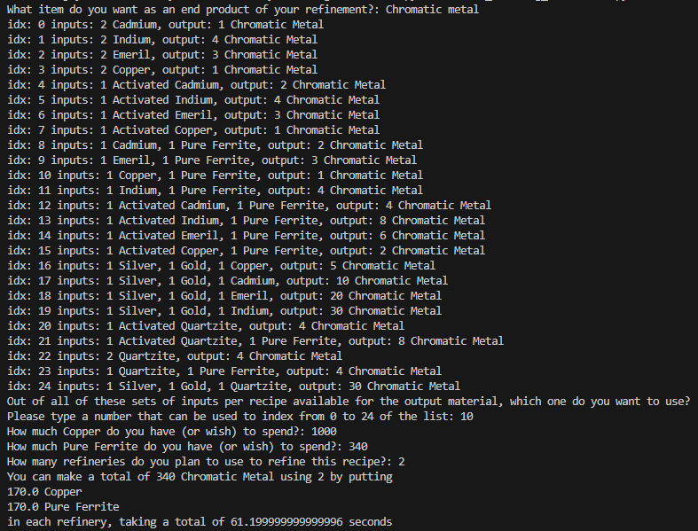
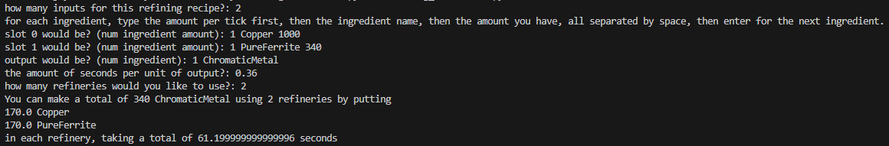

# No Man's Sky Refining Calculator
A command-line refining calculator for No Man's Sky

This calculator:
- Searches recipes based on desired output
- Calculates limiting resource using available inventory
- Calculates the amount to put in each refinery based on the amount of refineries you want to use
- Estimates refining time

## How to use
The online version is ran with:
```bash
python online_refining_calculator.py
```
The offline version is ran with:
```bash
python refining_calculator.py
```

### Online Example


### Offline Example


### ⚠️ WARNING ⚠️
The offline version requests the recipe itself that you would like to use, so you have to know beforehand 
or use an online resource like [no mans sky recipes](https://nomansskyrecipes.com) website, along with
the [wiki](https://nomanssky.fandom.com) to get the sec/unit


## Installation

```bash
git clone https://github.com/Jundertag/no-mans-sky-refining-calculator
cd no-mans-sky-refining-calculator
pip install -r reqirements.txt
```

## Credits

Recipe and item data provided by [Assistant for No Man's Sky](https://github.com/AssistantNMS) Open Source Database.

## License

This project is licensed under the GNU General Public License v3.0.
See the LICENSE file for details.
